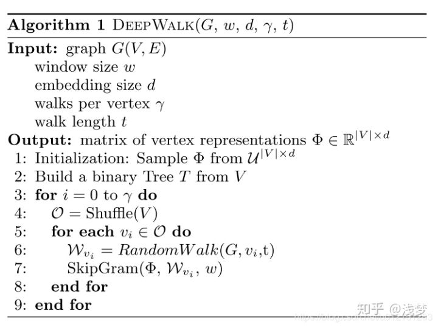

# DeepWalk 的原理记录

最近在看图神经网络，了解到图神经网络，主要包括Graph Embedding(基于随机游走)和Graph CNN(基于邻居汇聚)两部分。打算争取这段时间有空看看关于Graph Embedding

Graph Embedding技术将图中的节点以低维稠密向量的形式进行表达，要求在原始图中相似(不同的方法对相似的定义不同)的节点其在低维表达空间也接近。

### 原理：

首先word2vec 是一种常用的Word embedding方法，word2vec通过
语料库中的句子序列来描述词与词的共现关系，进而学习到词语的
向量表示。

DeepWalk的思想类似word2vec，使用**图中节点与节点的共现关系**来学习节点的向量表示。
那么最关键的问题是如何描述节点与节点的关系，DeepWalk提出的
方法是使用随机游走的方式在图中进行节点采样。

随机游走是一种**可重复访问已访问节点的深度优先遍历**算法。
给定一个访问节点，从其邻居中随机采样节点作为下一个访问节点
重复到达访问序列长度满足预设条件。

获取足够数量的节点访问序列后，使用skip-gram model 进行向量学习。

### DeepWalk 代码

首先附上DeepWalk的伪代码

DeepWalk算法包括两个步骤，第一步为随机游走采样节点序列，第二
步为使用Skip-gram word2vec 学习表达向量。

1. 从网络中的每个节点开始分别进行Random Walk 采样，得到局部相关联的训练数据；
	
	这里补充一下：
	>由于有所有的节点需要进行num_walks次，而每次采用的都是
	Random Walk的方式，所以可以采用多线程的方式进行处理，
	加快序列的生成。Parallel为多进程并行时的任务分配操作。
	

2. 采用word2vec模型进行训练，将所有节点向量化表示。直接采用gensim中的word2Vec模型。但是后续需要补充一下这个模型的原理和使用。
	
### 参考资料

1. 

2. 

