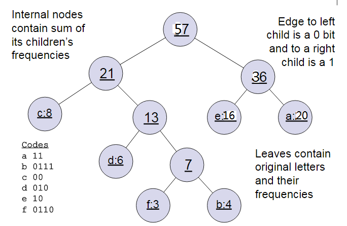

# word2vec

---

word2vec是一个非常基础的NLP工具，他的作用是将所有的词向量化，这样就可以度量词与词之间
的关系。

### 1. CBOW和Skip-Gram

在提出word2vec之前已经有一些用DNN网络来处理词向量化的方法。所以在说之前简单介绍一下
CBOW和Skip-Gram。

CBOW(Continuous Bag-of-Words) 模型的是输入其实就是通过上下文内容来预测中间词。所以
模型的输入就是一个特征词的上下文相关的词对应的词向量，输出的是这个特定词的词向量。
所以我们会设置一个窗口，就是特定词的上下文大小。而输出的是所有词的softmax概率，训练的
最终结果就是期望训练样本特定词对应的softmax概率最大。通过DNN的反向传播我们学习参数，使得
在给出新的输入的时候，通过softmax激活函数找到概率最大的词对应的神经元。


Skip-Gram模型和CBOW的思路是反着来的，即输入一个特定的词的词向量，输出的是特定词
对应的上下文词向量。在Skip-Gram中我们的输入是特定词， 输出是softmax概率排前8的8个词，
对应的Skip-Gram神经网络模型输入层有1个神经元，输出层有词汇表大小个神经元。
隐藏层的神经元个数我们可以自己指定。通过DNN的反向传播算法，我们可以求出DNN模型的参数，
同时得到所有的词对应的词向量。这样当我们有新的需求，要求出某1个词对应的最可能的8个上下
文词时，我们可以通过一次DNN前向传播算法得到概率大小排前8的softmax概率对应的神经元所对
应的词即可。

但是对于这种办法其实在实际问题中并不可行，因为当词的种类很大时，常常是百万级别，这样
计算softmax的时候计算量很大，所以对于word2vec做出来改进。

### 2.哈夫曼树

相信很多人在学数据结构的时候都学过，word2vec就是用哈夫曼树替代DNN来训练CBOW和Skip-Gram
模型得到词向量。哈夫曼树的叶子节点起到输出层神经元的作用，叶子节点的个数即为词汇表的小大。 
而内部节点则起到隐藏层神经元的作用。

我就具体用一个例子来说明一下：

我们有(a,b,c,d,e,f)共6个节点，节点的权值分布是(20,4,8,6,16,3)。

首先是最小的b和f合并，得到的新树根节点权重是7.此时森林里5棵树，根节点权重分别是20,8,6,16,7。
此时根节点权重最小的6,7合并，得到新子树，依次类推，最终得到下面的霍夫曼树。



哈夫曼树编码有什么好处呢？
1. 权重高的节点越靠近根节点，权重低的节点会远离根节点
2. 这样高权重节点的编码值越短，权重低的编码值会越长，这是保证了树的带权路径最短。
3. 哈夫曼树的编码是 左子树编码为0，右子树编码为1.如上图，则可以得到c的编码是00。

**在word2vec中，约定编码方式和上面的例子相反，即约定左子树编码为1，右子树编码为0，同时约定左子树的权重不小于右子树的权重。**

### 3.基于Hierarchical Softmax的word2vec模型
之前说传统的神经网络词向量语言模型，里面一般有三层，输入层（词向量），隐藏层和
输出层（softmax层）。里面最大的问题在于从隐藏层到输出的softmax层的计算量很大，
因为要计算所有词的softmax概率，再去找概率最大的值。
这个模型如下图所示。其中V是词汇表的大小，


**word2vec做出来改进：**
- 采用对输入此向量求和取平均值的方式替代DNN中从输入到隐藏层的
映射。
>比如输入的是三个4维词向量：(1,2,3,4),(9,6,11,8),(5,10,7,12),那么我们word2vec映射后的词向量就是(5,6,7,8)。

- 改进就是从隐藏层到输出的softmax层这里的计算量采样了霍夫曼树
	来代替从隐藏层到输出softmax层的映射。

**如何用哈夫曼树替代softmax层的映射？**


和之前的神经网络语言模型相比，我们的霍夫曼树的所有内部节点就类似之前神经网络隐藏
层的神经元,其中，根节点的词向量对应我们的投影后的词向量，而所有叶子节点就类似于
之前神经网络softmax输出层的神经元，叶子节点的个数就是词汇表的大小。在霍夫曼树
中，隐藏层到输出层的softmax映射不是一下子完成的，而是沿着霍夫曼树一步步完成的，
因此这种softmax取名为"Hierarchical Softmax"。

在word2vec中，我们采用了二元逻辑回归的方法，即规定沿着左子树走，那么就是负类
(霍夫曼树编码1)，沿着右子树走，那么就是正类(霍夫曼树编码0)。判别正类和负类的
方法是使用sigmoid函数，即：

$$P(+) = \sigma(x^T_w \theta)= frac{1}{1+e^{-x^T_w \theta}}$$

其中xw是当前内部节点的词向量，而θ则是我们需要从训练样本求出的逻辑回归的模型参数。

被划分为左子树而成为负类的概率为P(−)=1−P(+)。在某一个内部节点，要判断是沿左子
树还是右子树走的标准就是看P(−),P(+)谁的概率值大。而控制P(−),P(+)谁的概率值大
的因素一个是当前节点的词向量，另一个是当前节点的模型参数θ。

因此在哈夫曼树中的节点其实就是θ，对于每个词向量，可以都得到期望得到的结果，也就是
使训练样本达到最大似然。如何使得最大似然呢？

**怎么最大似然化**：

我们按照图片中的这个为例子我看详细说一下：


我们通过最大似然法来学习最好的节点向量和所有内部节点θ，对于上面面这幅图，我们来
看一下他的最大化似然函数：

$$\prod_{i=1}^3P(n(w_i),i) = (1- \frac{1}{1+e^{-x_w^T\theta_1}})(1- \frac{1}{1+e^{-x_w^T\theta_2}})\frac{1}{1+e^{-x_w^T\theta_3}}$$

对于所有的训练样本，我们期望最大化所有样本的似然函数乘积。

我们先做一下事先的定义：

- 定义输入的词为w,其从输入层词向量求和平均后的霍夫曼树根节点词向量为xw

- 从根节点到w所在的叶子节点，包含的节点总数为lw

- w在霍夫曼树中从根节点开始，经过的第i个节点表示为pwi,对应的霍夫曼编码为dwi∈{0,1},其中i=2,3,...lw。

- 该节点对应的模型参数表示为θwi, 其中i=1,2,...lw−1，没有i=lw是因为模型参数仅仅针对于霍夫曼树的内部节点。


定义w经过的哈夫曼树某一个节点j的逻辑回归概率为P(dwj|xw,θ_w^{j−1})，
其表达式为：
$$P(d_j^w|x_w, \theta_{j-1}^w)= \begin{cases}  \sigma(x_w^T\theta_{j-1}^w)& {d_j^w=0}\\ 1-  \sigma(x_w^T\theta_{j-1}^w) & {d_j^w = 1} \end{cases}$$

那么对于某一个目标输出词w,其最大似然为:
$$\prod_{j=2}^{l_w}P(d_j^w|x_w, \theta_{j-1}^w) = \prod_{j=2}^{l_w} [\sigma(x_w^T\theta_{j-1}^w)] ^{1-d_j^w}[1-\sigma(x_w^T\theta_{j-1}^w)]^{d_j^w}$$

其中使用的是随机梯度上升法，也就是说不使用全部样本的最大似然，而是随机选一个样本
更新梯度，虽然可能不是最好的梯度，但是这可以减少计算量。这样我们就可以得到w的
对数似然函数L：
$$L= log \prod_{j=2}^{l_w}P(d_j^w|x_w, \theta_{j-1}^w) = \sum\limits_{j=2}^{l_w} ((1-d_j^w) log [\sigma(x_w^T\theta_{j-1}^w)]  + d_j^w log[1-\sigma(x_w^T\theta_{j-1}^w)])$$

L= log \prod_{j=2}^{l_w}P(d_j^w|x_w, \theta_{j-1}^w) = \sum\limits_{j=2}^{l_w} ((1-d_j^w) log [\sigma(x_w^T\theta_{j-1}^w)]  + d_j^w log[1-\sigma(x_w^T\theta_{j-1}^w)])

然后我们通过梯度上升法，求出模型参数$θ^w_{j-1}$ 的梯度：
$$\begin{align} \frac{\partial L}{\partial \theta_{j-1}^w} & = (1-d_j^w)\frac{(\sigma(x_w^T\theta_{j-1}^w)(1-\sigma(x_w^T\theta_{j-1}^w)}{\sigma(x_w^T\theta_{j-1}^w)}x_w - d_j^w \frac{(\sigma(x_w^T\theta_{j-1}^w)(1-\sigma(x_w^T\theta_{j-1}^w)}{1- \sigma(x_w^T\theta_{j-1}^w)}x_w  \\ & =  (1-d_j^w)(1-\sigma(x_w^T\theta_{j-1}^w))x_w -  d_j^w\sigma(x_w^T\theta_{j-1}^w)x_w \\& = (1-d_j^w-\sigma(x_w^T\theta_{j-1}^w))x_w \end{align}$$

然后在求出xw的梯度：
$$\frac{\partial L}{\partial x_w} = \sum\limits_{j=2}^{l_w}(1-d_j^w-\sigma(x_w^T\theta_{j-1}^w))\theta_{j-1}^w$$

然后就是按照梯度上升的方法不断更新学习参数θ和xw。

### 4.基于Hierarchical Softmax的CBOW模型
由于word2vec有两种模型：CBOW和Skip-Gram,我们先看看基于CBOW模型时， Hierarchical Softmax具体如何使用。

**具体步骤**:

输入：基于CBOW的语料训练样本，词向量的维度大小M，CBOW的上下文大小2c,步长η

输出：霍夫曼树的内部节点模型参数θ，所有的词向量w

1. 首先定义词向量的维度大小M，以及CBOW的上下文大小2c，其中前面的c个词和后面的
	c个词作为了CBOW模型的输入，该词本身作为模型的输出，期望softmax概率最大。
	
2. 在用所有的词汇构建一颗哈夫曼树

3. 对w周围的2c个词向量求和取平均：$x_w = \frac{1}{2c}\sum\limits_{i=1}^{2c}x_i$

4. 通过梯度上升法来更新我们的θ和xw，注意这里的xw是由2c个词向量相加而成，我们做梯度更新完毕后会用梯度项直接更新原始的各个xi(i=1,2,,,,2c)，
	$$x_i= x_i +\eta  \sum\limits_{j=2}^{l_w}(1-d_j^w-\sigma(x_w^T\theta_{j-1}^w))\theta_{j-1}^w \;(i =1,2..,2c)$$
	其中η为梯度上升法的步长。

### 5.基于Hierarchical Softmax的Skip-Gram模型

现在我们先看看基于Skip-Gram模型时， Hierarchical Softmax如何使用。此时输入的只有一个词w,输出的为2c个词向量context(w)。

**具体步骤**:
输入：基于Skip-Gram的语料训练样本，词向量的维度大小M，Skip-Gram的上下文大小2c,步长η

输出：霍夫曼树的内部节点模型参数θ，所有的词向量w

1. 基于语料训练样本建立霍夫曼树。

2. 随机初始化所有的模型参数θ，所有的词向量w,

3. 进行梯度上升迭代过程，对于训练集中的每一个样本(w,context(w))做如下处理：
	a. for i =1 to 2c:

　　　　	i) e=0

　　　　	ii)for j = 2 to lw, 计算：
			$$f = \sigma(x_i^T\theta_{j-1}^w)$$
			$$g = (1-d_j^w-f)\eta$$
			$$e=e+gθ^w_{j−1}$$\theta_{j-1}^w= \theta_{j-1}^w+ gx_i
			$$\theta_{j-1}^w= \theta_{j-1}^w+ gx_i$$
		
		iii) 
			xi = xi + e
	
	b. 如果梯度收敛，则结束梯度迭代，算法结束，否则回到步骤a继续迭代。
	
	

### 6. 具体看看代码部分

基于Hierarchical Softmax部分

neule对应我们上面的e, 

syn0对应我们的xw,

syn1对应我们的θ,

layer1_size对应词向量的维度，

window对应我们的c。
	
- CBOW

	```
	 cw = 0;
	      for (a = b; a < window * 2 + 1 - b; a++) if (a != window) {
	        c = sentence_position - window + a;
	        if (c < 0) continue;
	        if (c >= sentence_length) continue;
	        last_word = sen[c];
	        if (last_word == -1) continue;
	        for (c = 0; c < layer1_size; c++) neu1[c] += syn0[c + last_word * layer1_size];
	        cw++;
	      }
	      if (cw) {
	        for (c = 0; c < layer1_size; c++) neu1[c] /= cw;
	        if (hs) for (d = 0; d < vocab[word].codelen; d++) {
	          f = 0;
	          l2 = vocab[word].point[d] * layer1_size;
	          // 函数f  就是向量和内部节点参数θ的乘积
	          for (c = 0; c < layer1_size; c++) f += neu1[c] * syn1[c + l2];
	          if (f <= -MAX_EXP) continue;
	          else if (f >= MAX_EXP) continue;
	          else f = expTable[(int)((f + MAX_EXP) * (EXP_TABLE_SIZE / MAX_EXP / 2))];
	          // g是乘以学习率以后的梯度
	          g = (1 - vocab[word].code[d] - f) * alpha;
	          // 更新参数 θ 
	          for (c = 0; c < layer1_size; c++) neu1e[c] += g * syn1[c + l2];
	          // 更新参数 W
	          for (c = 0; c < layer1_size; c++) syn1[c + l2] += g * neu1[c];
	        }
	```

- Skip-Gram

```
	for (a = b; a < window * 2 + 1 - b; a++) if (a != window) {
        c = sentence_position - window + a;
        if (c < 0) continue;
        if (c >= sentence_length) continue;
        last_word = sen[c];
        if (last_word == -1) continue;
        l1 = last_word * layer1_size;
        for (c = 0; c < layer1_size; c++) neu1e[c] = 0;
        // 按照哈夫曼树进行softmax 
        if (hs) for (d = 0; d < vocab[word].codelen; d++) {
          f = 0;
          l2 = vocab[word].point[d] * layer1_size;
          // 函数f  就是向量和内部节点参数θ的乘积
          for (c = 0; c < layer1_size; c++) f += syn0[c + l1] * syn1[c + l2];
          if (f <= -MAX_EXP) continue;
          else if (f >= MAX_EXP) continue;
          else f = expTable[(int)((f + MAX_EXP) * (EXP_TABLE_SIZE / MAX_EXP / 2))];
          // g是乘以学习率以后的梯度
          g = (1 - vocab[word].code[d] - f) * alpha;
          //  更新参数 θ 
          for (c = 0; c < layer1_size; c++) neu1e[c] += g * syn1[c + l2];
          // 更新参数 W
          for (c = 0; c < layer1_size; c++) syn1[c + l2] += g * syn0[c + l1];
        }
```

## 参考文章

[word2vec原理(一) CBOW与Skip-Gram模型基础](https://www.cnblogs.com/pinard/p/7160330.html)
